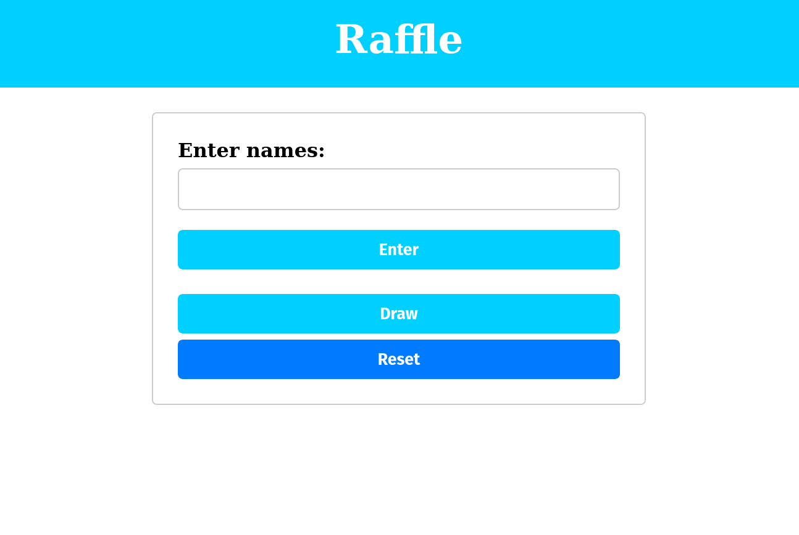
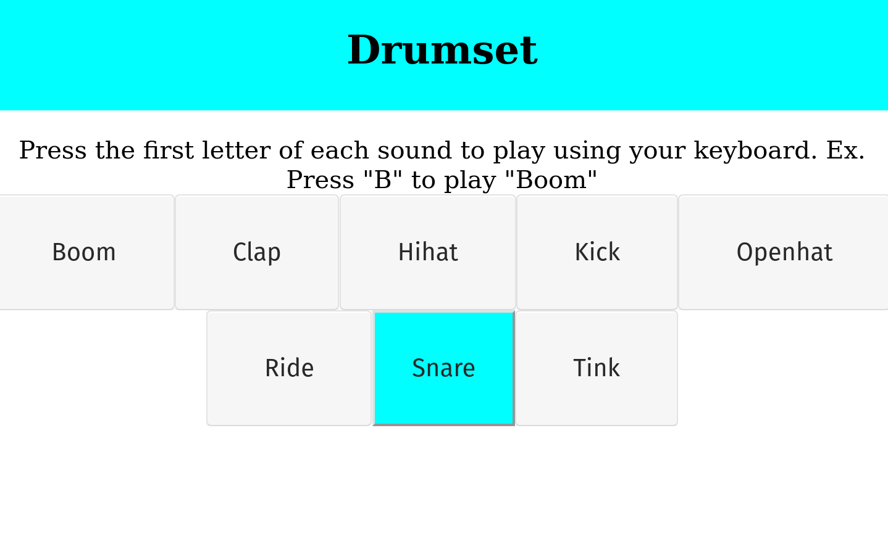

# Simple personal homepage
 Quick and simple personal homepage displaying info about me created in an afternoon. 
 https://matsrm.github.io/Simple-personal-homepage/

## Goal
The goal of this project is to practice building simple webapps using HTML, CSS and vanilla JS.

## About The Project

#### Portfolio section
- 
- 

### Raffle app

### Drumset

